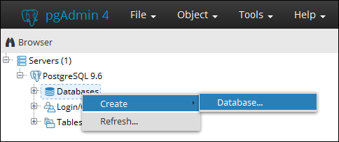
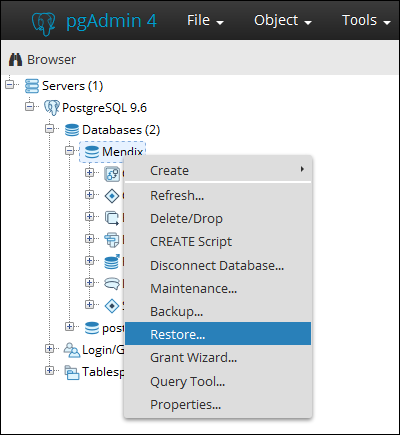
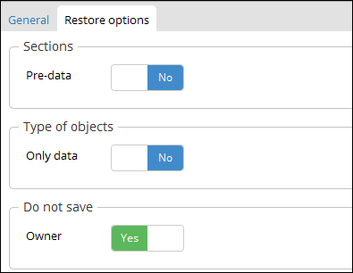
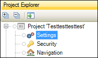
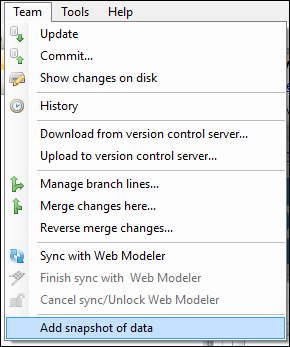

## 1 Introduction

There are 2 different databases:
1. External database (like Postgres).
2. Build-in-database.

You can use this how-to if you want to restore the database of your app in an external database or if you want to restore a database from another app to a new app.

**This how-to will teach you how to do the following:**

* Create a new database
* Create a data-snapshot
* Configure the project settings of the app

## 2 Download backup from the Developer Portal

In order to restore a backup locally, you must first [download the backup](/howto/how-to-download-a-backup) from the [Developer Portal](http://home.mendix.com).

## 3 External database

This guideline has been made with Postgres Installer version Version 9.6.5

Before starting this how-to, make sure you have completed the following prerequisites:

* Download the [Postgres Installer](https://www.postgresql.org/download/windows/) Version 9.6.5

### 3.1 Postgres

1. Start PgAdmin.
2. Double click **PostgreSQL 9.6**.
3. Click **Database** and **create** a new database.  

    

4. Fill in the **Database** name.
5. Select the correct owner click **Save**.
6. Rightclick on the newly created database and click **Restore**. 

    

7. Upload the correct **.backup** file.
8. Click on the **Restore options** tab.
9. Under **Owner** set **Don’t save** to **Yes**.

    

10. Click **Restore**.
11.	Wait until you see that the backup is **Successfully completed.** in the right corner of the screen.  

### 3.2 Modeler

1. Open Mendix **Desktop Modeler**. 
2. Click below **Project** on **Settings**.

    

3. Under the tab **Configurations** click **New**.

   

4. Fill in the database information. 

Configuration | Information
---- | ---
Type | PostreSQL
URL | localhost: 5432
Database name | Provide database name
User name | Provide user name from PgAdmin
Password | Provide same password as in PgAdmin

5. Click **OK**.
6. Run the app by clicking **Run Locally**.

## 4 Separate Build-in-database (data-snapshot)

If you want to import the build-in-database of another app to a new app, you can use the data-snapshot possibility.

### 4.1 Create data-snapshot

Create a data-snapshot from a different mendix app database by doing the following:

1. Open the Mendix app in the **Desktop Modeler**.
2. Click **Team** in the top navigation panel.
3. Click **Add snapshot of data**.

    

### 4.2 Transport data-snapshot root directory

After creating a data-snaphot, perform the following steps:

1. Go to the local root directory of your app containing the newly created data-snaphot **.zip** file.

You can find the root directory in behind the Mendix Desktop Modeler version:

   

2. Copy-paste the data-snapshot **.zip** file in the root directory of your new app.
3. Return to the Mendix **Desktop Modeler** and run the app locally, by clicking **Run Locally**.
