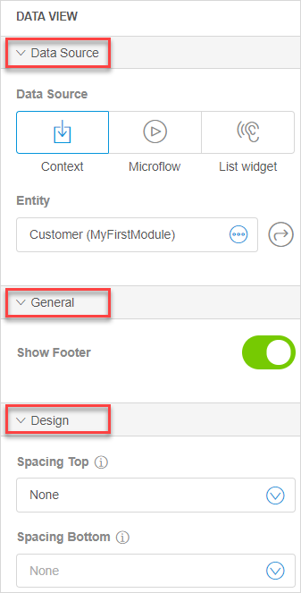
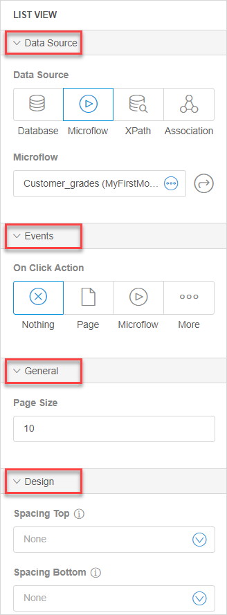

## 1 Introduction 

The data view is a starting point for showing the contents of one object on a page.  The data view typically contains input widgets like text boxes . 

For example, if you want to fill out the information on each customer, data view is the best way to do that.

In more complex templates, a data view can contain other data views for related objects, for example, showing customer details and showing customer payment status, if these are modeled as two different entities. 

## 2 Data View Properties  

Data view consists of the following properties:

* [Data Source](#data-source-data-view)
* [General](#general-section-data-view)
* [Design](#design-section-data-view)

### 2.1 Data Source Properties {#data-source-data-view} 

The data source determines which object will be shown in the data view. For general information on data sources, see [Data Sources](https://docs.mendix.com/refguide/data-sources). 

| Data Source Property | Description                                                  |
| -------------------- | ------------------------------------------------------------ |
| Context              | A data source determining that wherever you are opening the page from, you are passing the selected object. For example, when you add the **Show Page** activity in the microflow, you select the page and the object to pass. (For more information on the microflows, see [Microflows in the Web Modeler](microflows-wm).) That means that when the page is opened in the microflow, the object of this type is provided and will be shown in the data view on the page. For more technical information on the context source, see [Context Source](../refguide/entity-path-source). |
| Microflow            | A data source that runs a selected microflow and displays a return value. For more technical information, see [Microflow Source](../refguide/microflow-source). |
| List widget          | A data source that allows a data view to display detailed information on an object in the list widget (list view) on the same page. For more technical information, see [Listen To Widget Source](../refguide/microflow-source). |

### 2.2 General Section {#general-section-data-view}

In the **General** section, you can enable/disable the **Show Footer** option (enabled by default). A footer is an area at the bottom of the document, usually containing information common for all pages, such as copyrights.  

### 2.3 Design Section {#design-section-data-view}

The **Design** section of the data view properties allows you to change spacing and aligning of the data view on the page. Hover over the  icon to get more details on each option. 

## 3 List View Properties

List view consists of the following properties:

* [Data Source](#data-source-list-view)
* [General](#general-section-list-view)
* [Design](#design-section-list-view)

### 3.1 Data Source Properties {#data-source-list-view}

The data source determines which objects will be shown in the list view. For general information about data sources, see [Data Sources](../refguide/data-sources). 

| Data Source Property | Description                                                  |
| -------------------- | ------------------------------------------------------------ |
| Database             | A data source that determines that the object or objects shown are retrieved directly from the database. You need to select **Entity** (that you have in the domain model), or create a new entity, if you set database as the data source. For more technical information, see [Database Source](../refguide/database-source). |
| Microflow            | A data source that runs a selected microflow and displays a return value (i.e. list of objects). For more technical information, see [Microflow Source](../refguide/microflow-source). |
| XPath                | Currently, this data source can only be configured in the Desktop Modeler. For more information, see [XPath Source](../refguide/xpath-source). |
| Association          | Currently, this data source can only be configured in the Desktop Modeler. For more information, see [Association Source](../refguide/association-source). |

### 3.2 Events Section

 You can choose the **On Click Action** in the **Events** section. The **On Click Action** defines what action is performed when the user clicks a row of the list view. The following actions are available:

* **Nothing** – no action is taken when the user clicks a row in the list view
* **Page** –  the specified page is opened
* **Microflow** – the selected microflow is executed 
* **More** – contains the following type of actions:
  * **Save Changes** – saves (commits) all changes made on the page
  * **Cancel Changes** – rolls back all changes made on the page 
  * **Close Page** – closes the pop-up window (for pop-up pages) or navigates to the previously visited page  
  * **Sign Out** – the current user is signed out of the app 
  * **Open Link** – triggers an action based on the link type (for more information, see [Open Link Action Properties](#open-link-action-properties))

#### 3.2.1 Open Link Action Properties {#open-link-action-properties}

When you set the **On Click Action** to **Open Link**, several properties are available. See the description in the table below:

| Action Property | Description |
| --------------- | ----------- |
| Link Type         |For this property, the following options are available: <ul><li>**Web** – navigates to a website </li><li>**Email** – composes an email</li><li>**Phone Call** – starts a phone call</li><li>**Text Message** – sends a text message</li></ul>|
| Source          | For this property, the following options are available: <ul><li>**Use literal value** – you can fill a value out (Specify **Url** for **Web**, **Recipient** for **Email**, and **Phone Number** for **Phone Cal**l and **Message**) </li><li>**Use attribute** – if you select **Database**>**Entity** as a data source for the list view,  you can choose the attribute of a string type that belongs to the entity or create a new one (when the **Use attribute** option is configured, you do not need to fill out any information manually, it will be updated dynamically)</li></ul> **Note** When you configure **Email**, **Phone Call** or **Message** options, the corresponding default app will be opened on the device when the action is triggered, for example, the default email client will be opened to compose a message. |

### 3.3 General Section {#general-section-list-view}

In the **General** section, you can select the number of rows to be displayed on the page. After the indicated limit is reached, the **Load more...** button is displayed on the page.

### 3.4 Design Section {#design-section-list-view}

The **Design** section of the list view properties allows you to change spacing and aligning of the data view on the page. Hover over the  icon to get more details on each option. 

## 4 Related Content

* [Page Editor Overview in the Web Modeler](page-editor-wm)